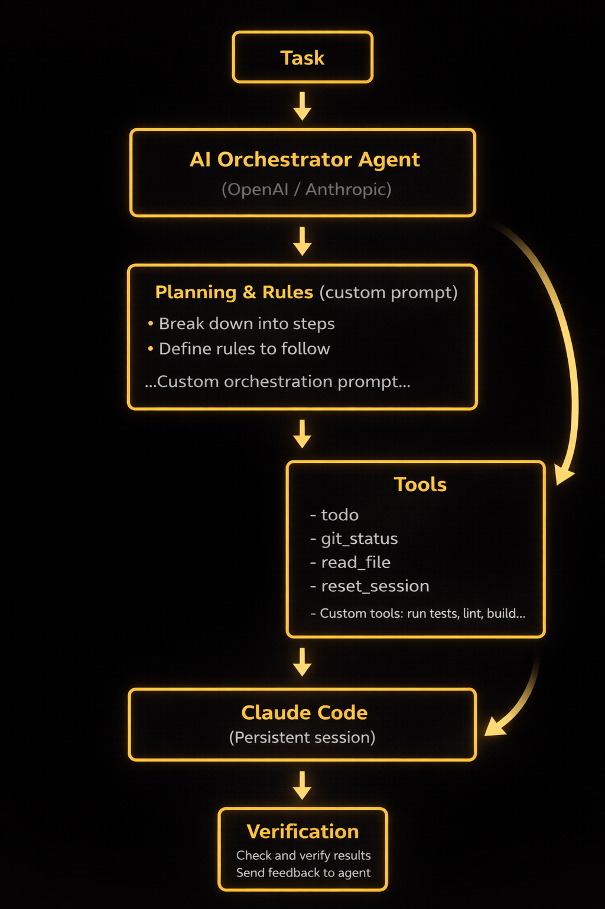

<p align="center">
  
</p>

<p align="center">
  <strong>Smart autonomous coding loop that orchestrates Claude Code using OpenAI or Anthropic as the reasoning agent.</strong>
</p>

<p align="center">
  Frink Loop takes your task, breaks it into subtasks, and executes them through Claude Code with persistent sessions and dynamic task management. The orchestrating AI decides when to continue, reset context, or adapt its approach.
</p>

<p align="center">
  Inspired by <a href="https://github.com/frankbria/ralph-claude-code">Ralph Loop</a>
</p>

---

## Features

- **Dual Provider Support** — Choose OpenAI (GPT-4o, GPT-5, o3) or Anthropic (Claude Sonnet/Opus) as orchestrator
- **Persistent Sessions** — Claude Code remembers context via `--resume`, with agent-controlled resets
- **Dynamic Task Management** — Add, update, and remove tasks during execution
- **Custom Tools** — Define project-specific commands in config
- **Interactive Setup** — Guided wizard for first-time configuration
- **YOLO Mode** — Auto-accepts all Claude Code actions for unattended execution

---

## Prerequisites

- **Node.js 20+**
- **Claude Code CLI** — The `claude` command must be available in your PATH
- **API Key** — OpenAI API key OR Anthropic API key

---

## Installation

### Local Development

```bash
git clone https://github.com/your-repo/frink-loop.git
cd frink-loop
npm install
npm run build
```

### Global Installation

After building, link the package globally:

```bash
npm link
```

This makes the `frink` command available system-wide.

### Verify Installation

```bash
frink --help
```

---

## Setup

Run the setup wizard to configure your provider and API key:

```bash
frink setup
```

The wizard will prompt you for:
1. **Provider** — OpenAI or Anthropic
2. **Model** — Select from available models
3. **API Key** — Your provider API key (stored in `.frink/.env`)

Configuration is stored in the `.frink/` directory in your current working directory.

---

## Quick Start

```bash
# First run triggers setup if not configured
frink

# Run with a task
frink "Add dark mode to the settings page"

# Specify working directory
frink "Fix TypeScript errors" --dir ./backend

# Use a custom prompt file
frink "Implement feature" --prompt ./PROMPT.md

# Enable debug output
frink "Debug this issue" --debug
```

---

## How It Works

<p align="center">
  
</p>

### Execution Flow

1. **Task Analysis** — Agent breaks your task into manageable subtasks
2. **Todo Creation** — Subtasks become a trackable todo list
3. **Execution Loop** — Each subtask is sent to Claude Code with context
4. **Verification** — Agent checks results before marking complete
5. **Adaptation** — New tasks added as discovered; session reset if needed
6. **Completion** — All tasks done, final summary reported

### Intelligent Context Management

Frink uses **persistent sessions** where Claude Code remembers previous work via `--resume`. This avoids re-explaining context on every call.

When Claude gets stuck (repeating errors, confused state), the agent calls `reset_claude_session` to start fresh:

```
Call 1: claude --session-id abc123 "Create auth module"
Call 2: claude --resume abc123 "Add login endpoint"      # Remembers Call 1
Call 3: claude --resume abc123 "Add tests"               # Remembers 1 & 2

[Agent detects repetitive failures]

Call 4: claude --session-id xyz789 "Fix auth tests"      # Fresh session
```

---

## Configuration

### Config File

Configuration is stored in `.frink/config.json` (in your project directory):

```json
{
  "provider": "openai",
  "model": "gpt-4o",
  "temperature": 0.7,
  "maxTokens": 4096,
  "customTools": []
}
```

API keys are stored separately in `.frink/.env`:

```bash
OPENAI_API_KEY=sk-...
# or
ANTHROPIC_API_KEY=sk-ant-...
```

### Environment Variables

You can also configure Frink via environment variables (useful for CI/CD):

| Variable | Description | Default |
|----------|-------------|---------|
| `OPENAI_API_KEY` | OpenAI API key (overrides config) | — |
| `ANTHROPIC_API_KEY` | Anthropic API key (overrides config) | — |
| `MAX_ITERATIONS` | Maximum loop iterations | `50` |
| `WORKING_DIRECTORY` | Default working directory | Current dir |

### Available Models

**OpenAI:**
- Recommended: `gpt-5.2`, `gpt-4o`
- Also available: `gpt-5.2-pro`, `gpt-5`, `gpt-5-pro`, `gpt-4.1`, `gpt-4.1-mini`, `gpt-4.1-nano`, `gpt-4o-mini`, `o3`, `o3-mini`, `o4-mini`, `o1`

**Anthropic:**
- Recommended: `claude-sonnet-4-5-20250929`
- Also available: `claude-opus-4-5-20251101`, `claude-haiku-4-5-20251001`, `claude-sonnet-4-20250514`, `claude-opus-4-20250514`

> **Note:** GPT-5 and o-series models are reasoning models that don't support the `temperature` parameter.

---

## CLI Reference

```bash
frink                              # Interactive mode / first-run setup
frink "your task"                  # Execute task in current directory
frink "task" --dir ./project       # Execute in specified directory
frink "task" --prompt ./prompt.md  # Use custom prompt file
frink setup                        # Run configuration wizard
frink --help                       # Show help
frink --debug                      # Enable debug output
```

### Options

| Option | Short | Description |
|--------|-------|-------------|
| `--dir <path>` | `-d` | Working directory for Claude Code |
| `--prompt <file>` | `-p` | Custom prompt file path |
| `--debug` | — | Enable verbose debug output |
| `--help` | `-h` | Show help message |

---

## Built-in Tools

The orchestrating agent has access to these tools:

| Tool | Description |
|------|-------------|
| `send_to_claude` | Send prompts to Claude Code session |
| `todo_write` | Replace entire task list |
| `todo_read` | Read current task list |
| `todo_add` | Add new tasks discovered during work |
| `todo_update` | Update task status (pending/in_progress/completed) |
| `todo_remove` | Remove a task by ID |
| `git_status` | Check git status of working directory |
| `read_file` | Read file contents |
| `mark_task_complete` | Signal overall task completion |
| `reset_claude_session` | Clear context, start fresh session |

---

## Custom Tools

Define project-specific commands in your config:

```json
{
  "customTools": [
    {
      "name": "run_tests",
      "description": "Run the test suite",
      "command": "npm test"
    },
    {
      "name": "run_test_file",
      "description": "Run a specific test file",
      "command": "npm test -- {{file}}",
      "parameters": [
        { "name": "file", "description": "Test file path", "required": true }
      ]
    },
    {
      "name": "lint",
      "description": "Run linter and auto-fix",
      "command": "npm run lint:fix"
    }
  ]
}
```

The agent can then use these tools during task execution.

---

## Custom System Prompt

Customize agent behavior by creating `.frink/prompt.md` in your project:

```markdown
# Frink Orchestrator

You are Frink, an AI orchestrator controlling Claude Code.

## Rules
- Always run tests after making changes
- Reset Claude session if it repeats the same error 3 times
- Prefer small, focused commits
- Ask for clarification before major refactors
```

---

## Development

### Scripts

```bash
npm run build    # Compile TypeScript to dist/
npm run dev      # Watch mode with hot reload
npm start        # Run directly with tsx (no build needed)
```

### Project Structure

```
frink-loop/
├── src/
│   ├── index.ts        # CLI entry point
│   ├── agent.ts        # Agent orchestration logic
│   ├── cli/            # CLI argument parsing
│   ├── config/         # Configuration management
│   ├── providers/      # OpenAI & Anthropic providers
│   ├── state/          # State management
│   ├── tools/          # Built-in tool definitions
│   └── ui/             # Terminal UI components
├── dist/               # Compiled output
├── .frink/             # Local config (gitignored)
├── package.json
├── tsconfig.json
└── README.md
```

### Testing Changes

```bash
# Build and test
npm run build
node dist/index.js "Test task"

# Or use tsx directly
npm start -- "Test task"
```

---

## Security

> **Important:** Never commit API keys or `.env` files to version control.

- API keys are stored in `.frink/.env` (project directory)
- Add `.frink/` to your project's `.gitignore`
- The root `.env` is already gitignored by default
- Use environment variables for CI/CD pipelines
- Rotate keys immediately if accidentally exposed

---

## Troubleshooting

### No API Key Found

```
Error: No API key configured
```

**Solution:** Run `frink setup` to configure your provider and API key.

### Claude Code Not Found

```
Error: claude command not found
```

**Solution:** Install Claude Code CLI and ensure it's in your PATH:
```bash
which claude  # Should return a path
```

### Claude Stuck in Loop

The agent should automatically detect and reset stuck sessions. If it persists:
- Use `--debug` flag to see what's happening
- Check if Claude Code is working: `claude "Hello"`
- Try a simpler task to verify setup

### Rate Limiting

If you hit API rate limits:
- The agent will pause and retry automatically
- Consider using a less expensive model for testing
- Check your API usage dashboard

### Session Issues

```
Error: Failed to resume session
```

**Solution:** Sessions may expire. The agent will create a new one automatically. If issues persist, the agent uses `reset_claude_session` to start fresh.

### Debug Mode

Enable verbose output to diagnose issues:

```bash
frink "your task" --debug
```

This shows:
- Agent reasoning
- Tool calls and responses
- Claude Code commands
- Session management decisions

---

## Comparison with Ralph Loop

| Aspect | Ralph Loop | Frink Loop |
|--------|------------|------------|
| Language | Bash | TypeScript |
| Session | Fresh every call | Persistent with `--resume` |
| Context | Lost between calls | Preserved, reset when needed |
| Orchestration | Bash script | AI agent (OpenAI/Anthropic) |
| Task Tracking | None | Dynamic todo list |
| Provider | Claude only | OpenAI or Anthropic |
| Extensibility | Limited | Custom tools support |

---

## Acknowledgments

- [Ralph Loop](https://github.com/frankbria/ralph-claude-code) — Original autonomous loop concept that inspired this project
- [Strands Agents SDK](https://strandsagents.com) — OpenAI agent framework
- [Claude Code](https://claude.ai/code) — Anthropic's coding assistant CLI

---

## License

MIT
